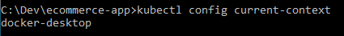
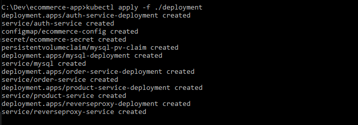

# Backend Engineering Challenge - E-Commerce Microservices Application

## Introduction

This document provides instructions and insights into the microservices-based e-commerce application designed to manage user authentication, product management, and order processing. The architecture emphasizes concurrency control and high availability through clustering.

## System Overview

The system follows a microservices architecture pattern, with distinct services for user authentication, product management, and order processing. These services are containerized using Docker and orchestrated with Kubernetes for high availability. The application is designed to scale horizontally, ensuring reliability and fault tolerance.

## Running the Code

To run the app, you need docker installed. You can install and configure docker for development from the official docker site: https://docs.docker.com/engine/install/

Once docker is installed, you also need to install kubernetes and configure a local cluster, let's name it docker-desktop

Under settings in docker desktop app, select kubernetes and then select "Enable Kubernetes." Follow the prompts to set up kubernetes for docker.

To ensure that you have a local kubernetes context installed, run this docker command and you should see the local context listed (probably among others that you may have configured prior)

`kubectl config current-context`



To set up the kubernetes database config map to create the relevant databases (ecommerceDB, ordersDB, productsDB, and authDB), run this command:

`kubectl create configmap mysql-init-db --from-file=sql-scripts\init-db.sql`

Once that is done, open the deployments folder, and set up the environment variables such as MYSQL_ROOT_PASSWORD under

[Title](deployment/ecommerce-config.yml) and [Title](deployment/ecommerce-secret.yml)

These variables are named in a way that is easy to understand, but they essentially include database names.

Again, set up the environment variables in the github repository for the github CI/CD pipeline.


Once that is done, you can run the kubernetes cluster on the docker-desktop context by running the containers using the following commands:

`kubectl apply -f ./deployment`



## Requirements Implemented

### Microservices Architecture

The application is broken down into three main microservices:
Auth Service: Manages user registration and authentication.
Product Service: Handles CRUD operations for products.
Order Service: Processes orders and maintains order history.
Each service is built using Node.js and Express for ease of development and deployment.

### Concurrency Control

Optimistic locking is implemented in the Product Service to manage concurrent updates to product information safely.

### Clustering and High Availability

Kubernetes is used for clustering the microservices, ensuring the application remains available even if a node goes down.
The application is configured to deploy on multiple nodes using Kubernetes' deployment and service definitions.

### Load Balancing

The Nginx load balancer plays a crucial role in the microservices architecture of the e-commerce application. It sits in front of the user authentication, product management, and order processing services as a reverse proxy, directing incoming HTTP requests to the appropriate service based on the request path. Here's how it integrates with the system:

#### Nginx Load Balancer Integration

Functionality:
Routing: Nginx evaluates incoming requests and forwards them to the corresponding microservice. For example, requests to /api/v0/auth are routed to the Auth Service.
Load Distribution: In a production environment, Nginx can distribute incoming traffic across multiple instances of a microservice, providing load balancing to ensure even utilization of resources.
High Availability: By monitoring the health of microservice instances, Nginx can reroute traffic away from unhealthy instances to maintain availability.
Deployment:
In local development, Nginx is configured within a Docker container specified in the docker-compose.yml file. It uses the Docker network to communicate with microservice containers.
In Kubernetes, an Nginx Ingress Controller is used to achieve similar functionality. It acts as an entry point for all HTTP requests coming into the Kubernetes cluster.
Configuration:
The Nginx configuration file (nginx.conf) includes upstream definitions for each microservice and location blocks within the server context to define routing rules.
SSL termination can be configured at the Nginx level, providing secure HTTPS communication.
Benefits:
Security: By centralizing entry into the application through Nginx, security measures like SSL/TLS, rate limiting, and IP filtering can be managed efficiently.
Simplicity: Developers can run a single Nginx instance to manage traffic to all microservices, simplifying the network architecture.
Performance: Nginx is highly performant and can handle a large number of concurrent connections with minimal resource usage.
The implementation details and configuration specifics of the Nginx load balancer are documented within the nginx directory of the repository, and deployment instructions for both local and Kubernetes environments are provided. The use of Nginx enhances the scalability, reliability, and security of the e-commerce application.

### Database Integration

MySQL database is used for persistent storage.
Each service connects to the database via Sequelize ORM, with a well-defined schema for users, products, and orders.

### APIs and Communication

RESTful APIs are developed for each microservice, facilitating inter-service communication.
Synchronous HTTP calls are used for direct service-to-service communication.

### Authentication and Authorization

JWT-based authentication is implemented to secure endpoints.
Authorization logic ensures users can only access their data.
General Requirements Met

### Code Quality

The codebase is clean, consistently formatted, and well-documented.
Expressive variable names and clear function definitions are used throughout the application.

### Version Control

Git is utilized for version control, with a structured commit history that reflects the development process.
Error Handling
Comprehensive error handling is in place, with consistent error responses and logging for debugging.

### Testing

Unit tests are written for key components, particularly around concurrency control mechanisms.
Jest test suites are configured under each microservice, and can be run using the command
`npm run test`
under each microservice folder.

### Deployment

Docker Compose is used for local development and testing.

To run all docker containers to test in development mode, you can run:

`docker-compose --env-file .env.dev up --build`

Kubernetes manifests are provided for deployment on clusters.

### Bonus Features

API rate limiting was considered but not implemented within the scope of this project.

### Repository and Deployment Instructions

The project is hosted on GitHub at [GitHub Repository Link]. To set up and run the microservices:

Ensure Docker and Kubernetes (Docker Desktop's Kubernetes or Minikube) are installed and running.
Clone the repository using git clone [Repository URL].
Navigate to each service directory and build Docker images with docker build -t [service-name]:[tag] ..
Apply Kubernetes manifests using kubectl apply -f [manifest-file].yml for each service.
The services will be accessible on the configured ports after the pods are running.

## Assessment and Assumptions

The application meets the core objectives laid out in the assignment. Due to time constraints, some advanced features like caching and message queues are not implemented. These are recommended areas for future development.

The primary assumption is that the Kubernetes cluster is already configured and accessible. For local development, the system uses port forwarding to expose services.

## Conclusion

The e-commerce microservices application demonstrates the use of modern backend technologies to create a scalable, fault-tolerant system. With the foundation laid out, the system can be expanded with additional features and integrations.

```

```
